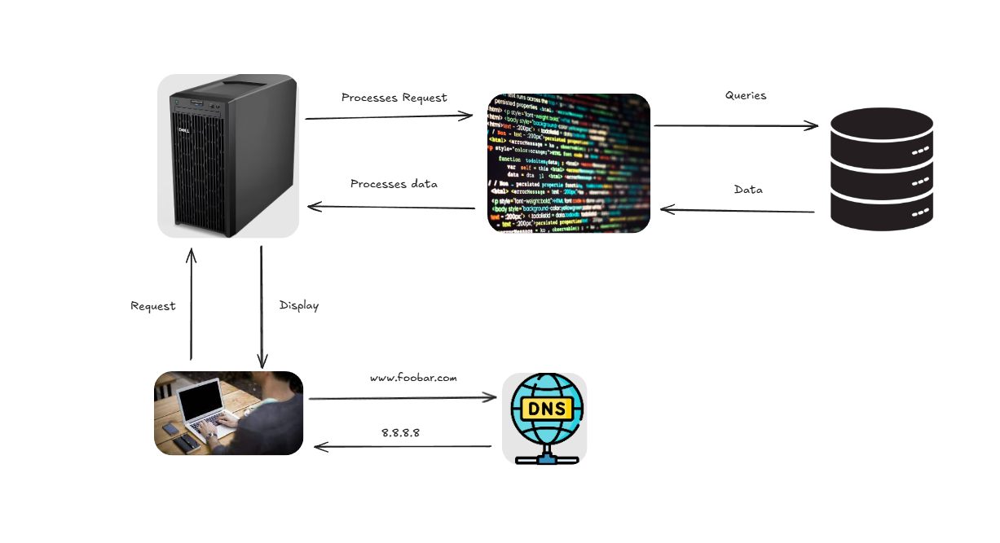

# HTTP Request Flow and Single Point of Failure (SPOF) Considerations

---

### **1. URL Entry**  
The user types **www.foobar.com** into their browser.

---

### **2. DNS Resolution**  
The browser sends a **DNS query** to resolve the domain name into an IP address.  
The DNS server returns the corresponding IP address to the browser.

---

### **3. Connection Establishment**  
With the obtained IP address, the browser establishes a connection with the server and sends an **HTTP request**.  
This request includes:
- The URL of the requested resource (e.g., `index.html`, `styles.css`).
- Additional header information.

---

### **4. Server Reception**  
The server receives the HTTP request and forwards it to **Nginx**, the web server.

---

### **5. Request Analysis by Nginx**  
Nginx analyzes the request to determine the type of resource being requested (HTML, CSS, images, etc.):  

- **Static Resource**:  
  Nginx locates the file on the system and sends it directly to the browser in an **HTTP response**.

- **Dynamic Resource**:  
  Nginx forwards the request to the **application server**, which processes it and may interact with the **MySQL database** to retrieve necessary data.  
  The application server generates the dynamic HTML content and sends it back to Nginx.  
  Nginx then embeds the content in an HTTP response and delivers it to the user's browser.

---

### **6. Content Display**  
The browser renders the content, making the webpage visible to the user.

---

## Single Point of Failure (SPOF) Considerations

### **Server Downtime**  
If the server goes down, the entire website becomes inaccessible.

### **Maintenance Impact**  
Scheduled maintenance results in the complete shutdown of the website.

### **Low Scalability**  
A single server limits the number of concurrent connections, potentially causing performance issues under heavy traffic.

---

## Diagram Reference
Below is a diagram illustrating the simple web stack described above:

