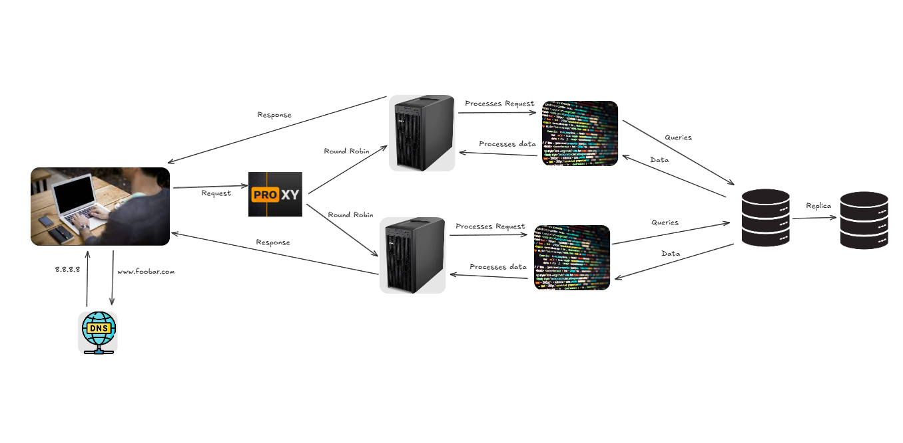

# Three-Server Web Infrastructure Design

---

## 1. **Request Flow**

1. **Client Request**:  
   The user types `www.foobar.com` into their browser.

2. **DNS Resolution**:  
   The DNS resolves the domain name to the IP address of the **HAProxy load balancer**.

3. **Load Balancer Distribution**:  
   - **HAProxy** distributes incoming requests using the **Round Robin** algorithm:  
     - Alternates requests between **Server 1** and **Server 2**.  
     - **Active-Active** configuration: Both servers handle traffic simultaneously.  
   - If one server fails, HAProxy automatically redirects traffic to the remaining server.

4. **Server Processing**:  
   - **Nginx** (web server) handles the HTTP request.  
   - The **application server** processes dynamic content and interacts with the database.  
   - Database queries are routed:  
     - **MySQL Primary** for write operations (`INSERT`, `UPDATE`, `DELETE`).  
     - **MySQL Replica** for read operations (`SELECT`).

5. **Response**:  
   The server sends the processed response back to the client.

---

## 2. **Database Configuration**

### **MySQL Primary Node**  
- Handles all **write operations** (`INSERT`, `UPDATE`, `DELETE`).  
- Maintains a **binary log** of all data changes.  
- Replicates changes to the **Replica node** in real-time.  

### **MySQL Replica Node**  
- Receives data updates from the **Primary node**.  
- Handles **read operations** (`SELECT`) to reduce the load on the Primary node.  
- Provides **redundancy** and can be promoted to Primary if the Primary node fails.  

---

## 3. **Infrastructure Components**

### **Why Each Component is Added**  
- **2 Servers**:  
  - Provide redundancy and high availability.  
  - Distribute traffic to handle higher loads.  

- **Nginx (Web Server)**:  
  - Efficiently serves static content and forwards dynamic requests to the application server.  

- **Application Server**:  
  - Processes dynamic content and business logic.  
  - Interacts with the database to fetch or update data.  

- **HAProxy (Load Balancer)**:  
  - Distributes traffic evenly across servers.  
  - Ensures high availability by rerouting traffic if a server fails.  

- **MySQL Database**:  
  - Stores and manages application data.  
  - Primary-Replica setup ensures data redundancy and improves read performance.  

---

## 4. **Load Balancer Configuration**

### **Distribution Algorithm**  
- **Round Robin**:  
  - Distributes requests sequentially between servers.  
  - Ensures even load distribution.  

### **Active-Active vs. Active-Passive**  
- **Active-Active**:  
  - Both servers handle traffic simultaneously.  
  - Provides better resource utilization and scalability.  

- **Active-Passive**:  
  - Only one server handles traffic while the other remains on standby.  
  - Used for failover scenarios but less efficient for resource utilization.  

---

## 5. **Primary-Replica (Master-Slave) Cluster**

### **How It Works**  
- The **Primary node** handles all write operations and logs changes in a binary log.  
- The **Replica node** reads the binary log and replicates the changes.  
- The Replica node can handle read operations, reducing the load on the Primary node.  

### **Difference Between Primary and Replica**  
- **Primary Node**:  
  - Handles writes and maintains data consistency.  
  - Critical for data integrity.  

- **Replica Node**:  
  - Handles reads and provides redundancy.  
  - Can be promoted to Primary if the Primary node fails.  

---

## 6. **Infrastructure Issues**

### **Single Points of Failure (SPOF)**  
- **HAProxy Load Balancer**:  
  - If HAProxy fails, traffic cannot be distributed, causing downtime.  
- **MySQL Primary Node**:  
  - If the Primary node fails, write operations are halted until a Replica is promoted.  
- **Individual Server Components**:  
  - Hardware failures in any server can disrupt service.  

### **Security Issues**  
- **No Firewall**:  
  - Exposes the infrastructure to unauthorized access and attacks.  
- **No HTTPS**:  
  - Data transmitted between the client and server is not encrypted.  
- **Exposed Ports and Services**:  
  - Increases the risk of exploitation.  
- **No Network Segmentation**:  
  - A breach in one component could compromise the entire infrastructure.  

### **Monitoring Gaps**  
- **No Server Health Monitoring**:  
  - Unable to detect hardware or software failures in real-time.  
- **No Performance Metrics**:  
  - Cannot track resource usage or optimize performance.  
- **No Error Tracking**:  
  - Difficult to diagnose and fix issues.  
- **No Automated Alerting**:  
  - Delays in responding to critical failures.  

---

## 7. **Diagram Reference**  
Below is a diagram illustrating the three-server web infrastructure:

