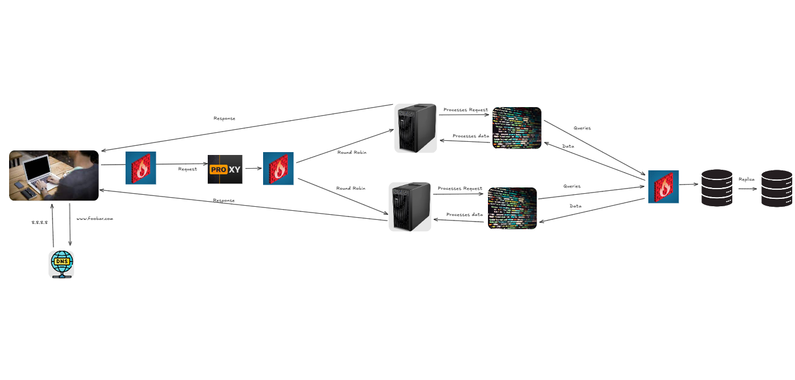

# Request Flow

1. **Client** initiates an HTTPS request to `www.foobar.com`.
2. Traffic passes through **Firewall 1**.
3. **Load Balancer** processes the request:
   - Terminates SSL.
   - Distributes traffic between servers.
4. Traffic passes through **Firewall 2**.
5. **Selected Server** processes the request:
   - **Nginx** handles the HTTP request.
   - **Application Server** processes dynamic content.
   - Database queries are routed through **Firewall 3**.
6. **Database Operations**:
   - Writes are directed to the **MySQL Primary**.
   - Reads can be handled by a **Replica**.
7. The response is sent back to the client via HTTPS.

# Security Components

1. **Firewalls**:

   - **Firewall 1**: Protects the entry point by filtering incoming traffic.
   - **Firewall 2**: Protects servers from unauthorized access.
   - **Firewall 3**: Secures database servers, ensuring only application servers can access them.

2. **SSL Certificate**:

   - Enables HTTPS for `www.foobar.com`.
   - Encrypts data in transit between clients and servers.
   - Provides authentication and trust for visitors.

3. **Monitoring Clients** (3):
   - Installed on each server to collect performance metrics.
   - Monitors system resources (CPU, memory, disk usage).
   - Tracks application performance and errors.

# Additional Elements & Their Purpose

1. **Firewalls** (3):

   - Act as security barriers, filtering traffic based on predefined rules.
   - **Firewall 1**: Protects the entire infrastructure from external threats.
   - **Firewall 2**: Protects application servers from unauthorized access.
   - **Firewall 3**: Secures database servers from direct access.

2. **SSL Certificate**:

   - Enables HTTPS for encrypted client-server communication.
   - Provides website authentication.
   - Ensures data privacy and integrity.
   - Required for secure handling of sensitive data.

3. **Monitoring Clients**:

   - Installed on each server to collect performance data.
   - Monitors system health and resource usage.
   - Enables early detection of issues.
   - Facilitates capacity planning and optimization.

4. **Purpose of Firewalls**:

   - Control incoming and outgoing network traffic.
   - Filter malicious traffic and block unauthorized access.
   - Protect sensitive data and services.
   - Create secure network zones.
   - Monitor and log network activity.

5. **Why Traffic is Served Over HTTPS**:

   - Encrypts data between client and server.
   - Prevents man-in-the-middle attacks.
   - Protects sensitive information like passwords.
   - Required for secure e-commerce and login systems.
   - Builds trust with users.

6. **Purpose of Monitoring**:

   - Track system performance and health.
   - Detect and alert on issues.
   - Monitor resource usage (CPU, memory, disk).
   - Analyze traffic patterns and trends.
   - Plan capacity and optimize performance.

7. **How Monitoring Tools Collect Data**:

   - Agents installed on servers collect metrics.
   - Regular polling of system statistics.
   - Log file analysis.
   - Performance counter monitoring.
   - Network traffic analysis.

8. **How to Monitor Web Server QPS**:
   - Configure Nginx access log monitoring.
   - Set up metrics collection at regular intervals.
   - Create a dashboard for QPS visualization.
   - Set up alerts for abnormal patterns.
   - Track trends for capacity planning.

# Risks and Issues

1. **Terminating SSL at the Load Balancer Level**:

   - All traffic after the load balancer flows unencrypted within the internal network.
   - If an attacker gains access to the internal network, they can:
     - Intercept sensitive data.
     - Capture user credentials.
     - Monitor internal communications.
   - **Best Practice**: Implement end-to-end encryption or re-encryption after the load balancer.

2. **Single MySQL Server for Writes**:

   - Single point of failure for all write operations.
   - No failover capability if the primary database crashes.
   - Limited write scalability as all writes must go through a single server.
   - System downtime during primary database maintenance.
   - Risk of data loss if the primary fails during write operations.
   - No ability to distribute write load during high traffic.

3. **Servers with All the Same Components**:

   - **Resource Contention**: All components compete for the same server resources (CPU, RAM, Disk I/O).
   - **Scaling Inefficiency**: Can't scale individual components based on needs.
   - **Security Risk**: Compromise of one component affects all others on the same server.
   - **Maintenance Complexity**: Updates/changes affect all components simultaneously.
   - **No Specialized Optimization**: Can't optimize servers for specific roles.
   - **Higher Costs**: Must scale all components even if only one needs more resources.

4. **Addressing These Issues**:

   - Implement end-to-end encryption.
   - Use database clustering with multiple write nodes.
   - Separate components onto dedicated servers or use containerization.

   ## **Diagram Reference**

   Below is a diagram illustrating the three-server web infrastructure:

