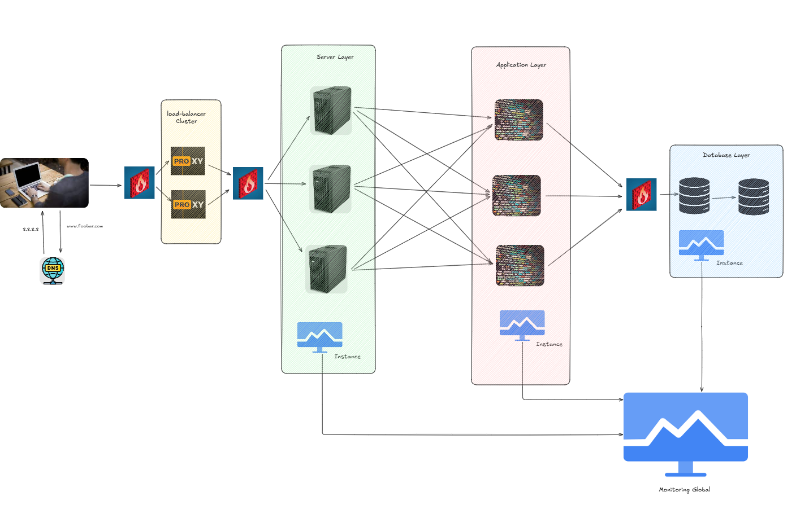

# Infrastructure Improvements

## 1. HAProxy Load Balancer Cluster
- **High-Availability Setup**:
  - Added a second HAProxy instance to form a high-availability cluster.
  - Eliminates the load balancer as a single point of failure.
- **Seamless Failover**:
  - Utilizes floating IP addresses for smooth transition during failover.
- **SSL Termination**:
  - Both HAProxy instances handle SSL termination for secure traffic management.

---

## 2. Component Separation
- **Web Servers (Nginx)**:
  - Moved to a dedicated layer for better resource management.
- **Application Servers**:
  - Separated into their own layer for improved scalability and security.
- **Database Servers**:
  - Remain in their own isolated layer.
- **Benefits**:
  - Enhanced resource allocation.
  - Stronger security isolation.
  - Flexible scalability options.
  - Simplified maintenance processes.

---

## 3. Additional Server in Web and Application Layers
- **Third Server Added**:
  - Introduced a third server in both the web and application layers.
- **Key Advantages**:
  - **Increased Availability**: Distributes load more effectively.
  - **Zero Downtime Maintenance**: Enables server maintenance without interrupting services.
  - **Redundancy**: Provides backup in case of server failure.

---

## 4. Impact of Changes
- **Robust and Scalable Infrastructure**:
  - **HAProxy Cluster**: Removes the load balancer as a single point of failure.
  - **Component Separation**: Allows independent scaling of each layer (web, application, database).
  - **Third Server**: Adds capacity and redundancy for higher reliability.
  - **Security**: Maintains strong boundaries with separate firewalls for each layer.

---

# Summary of Benefits
- **High Availability**: No single point of failure with HAProxy cluster and additional servers.
- **Scalability**: Each layer can scale independently based on demand.
- **Redundancy**: Extra servers ensure continuous operation during failures or maintenance.
- **Security**: Layered architecture with dedicated firewalls enhances protection.

